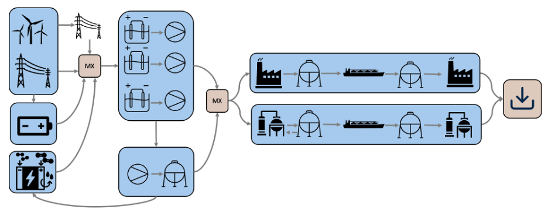
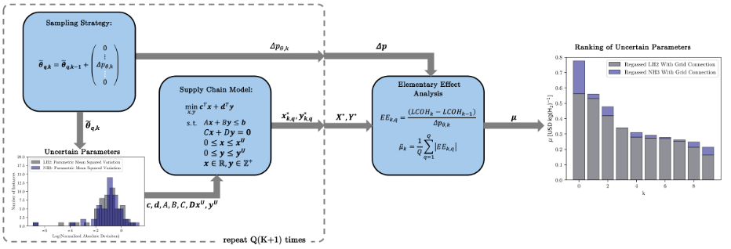

# Chile-Rotterdam Supply Chain Model [](https://opensource.org/licenses/MIT)
Open Source Model for a Hydrogen Supply Chain from Chile to Rotterdam, the modelled supply chain is shown in the figure, below:


 

## Dependencies
In order to run this model, a licence for [gurobi](https://www.gurobi.com/) is required, as is an installation of [conda](https://docs.anaconda.com/miniconda/). 

## Quick Start
For a quick start, clone the repository and run the following bash command from within the repository, to set up the conda environment:

```
conda env create -f MIPSupplyChain.yml
```

Then activate the environment using the following:

```
source activate MIPSupplyChain
```
To run the sample formulation, execute the bash script as follows

```
bash SolveModel.sh
```
## Parametric Modification
In order to manually change parameters, head to the pre-optimisation datastore and change the values of the parameters in the middle of the upper and lower bounds. These are taken as default values for the model when solving. Other, formualation specific, parameters can be found in the 'Executionscripts/BuildModel.py' file, this is accessed prior to each model solution. 

## Sensitivity Studies
The below figure shows the mathematical framework for the global sensitivity studies:



The files to generate the global sensitivity studies, but the execution scripts are omitted. These were solved on a HPC cluster and, as such, are coded in a somewhat proprietary manner. Any user wishing to perform these solves is encouraged to produce a suitable shell script that can parallelise the solves for their system. The global sensitivity scripts are coded in such a manner that they solve in three stages: 
  1) The first stage builds the models and saves them in the 'PreSolvedModelsFolder'. This step is computed serially.
  2) On completion of the first stage, the second stage access a list of model names from the SolverLogs folder, and accesses these using an 'array index' of the hpc clusters multisolve capability. This step is computed in parallel.
  3) For the final stage, once the parallel solves are complete, the final stage calculates the global sensitivity parameters and saves them to the 'DataAnalysis' folder. This stage is computed serially. 
